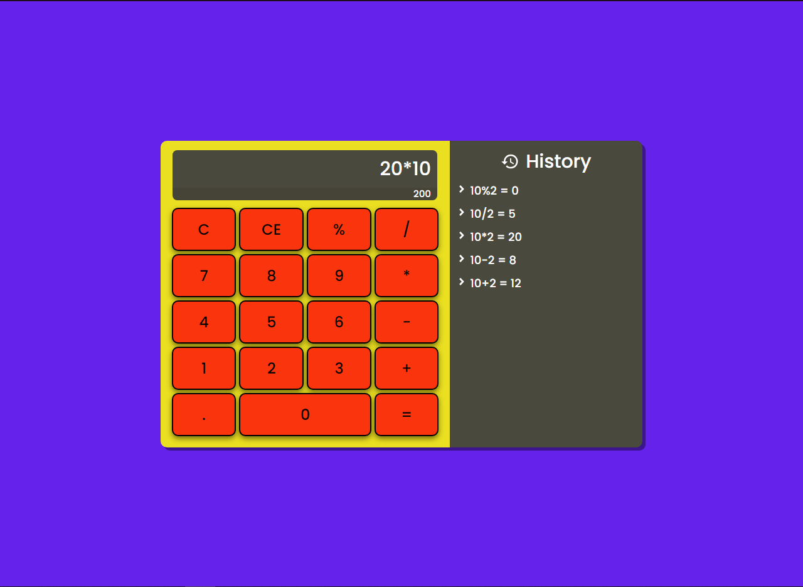

# 🎲 React Web Calculator

A web calculator built with **React**, **MathJS**, **TypeScript** & **Styled Components**.




## 📖 Features

- Perform basic arithmetic operations
- Keep history of the last 5 valid expressions
- Clean and responsive UI designed with Styled-Components
- Real time expression evaluation using the mathjs library


## 🌎 Technologies Used

- React
- MathJS
- TypeScript
- Styled-Components


## 📋 Installation

```
1. Clone the repository
git clone https://github.com/FabricioDosSantosMoreira/react-web-calculator.git

2. Navigate to the directory
cd '.\react-web-calculator\app'

3. Install the dependencies
npm install

4. Start the dev server
npm start

5. (Optional) Build the app
npm run build
```


## 💡 Contribution

Feel free to contribute with any suggestions, corrections or tips. Just open a pull request!


## 📃 License

The project is licensed under the MIT License. See the [LICENSE](LICENSE/) for more information.
